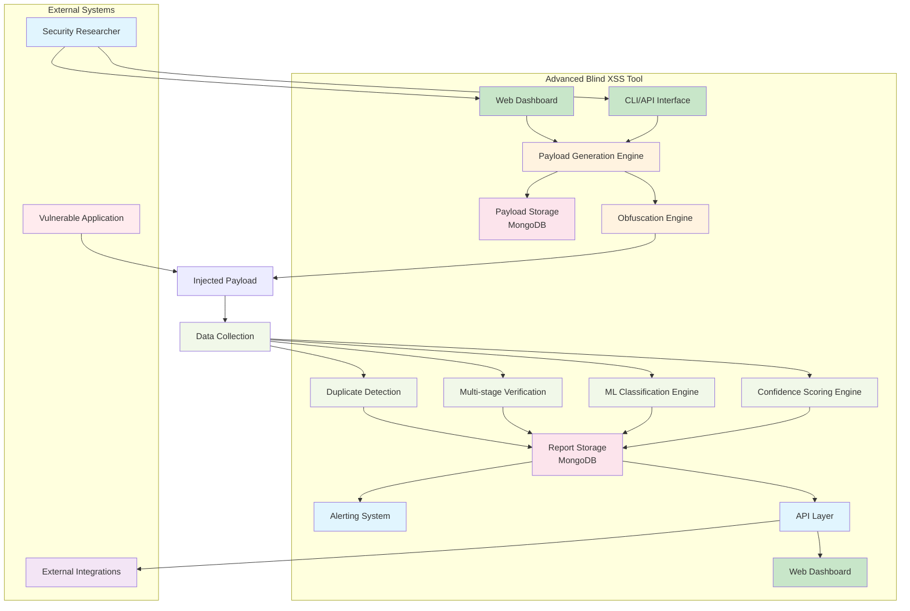

# Advanced Blind XSS Tool Architecture Diagram

```mermaid
graph TB
    A[Security Researcher] --> B[CLI/API Interface]
    A --> C[Web Dashboard]
    
    B --> D[Payload Generation Engine]
    C --> D
    
    D --> E[Payload Storage<br/>MongoDB]
    D --> F[Obfuscation Engine]
    
    G[Vulnerable Application] --> H[Injected Payload]
    F --> H
    
    H --> I[Data Collection]
    I --> J[Confidence Scoring Engine]
    I --> K[ML Classification Engine]
    I --> L[Multi-stage Verification]
    I --> M[Duplicate Detection]
    
    J --> N[Report Storage<br/>MongoDB]
    K --> N
    L --> N
    M --> N
    
    N --> O[Alerting System]
    N --> P[API Layer]
    P --> Q[Web Dashboard]
    P --> R[External Integrations]
    
    subgraph "Advanced Blind XSS Tool"
        B
        C
        D
        E
        F
        J
        K
        L
        M
        N
        O
        P
        Q
    end
    
    subgraph "External Systems"
        A
        G
        R
    end
    
    style A fill:#e1f5fe
    style G fill:#ffebee
    style R fill:#f3e5f5
    style B fill:#c8e6c9
    style C fill:#c8e6c9
    style Q fill:#c8e6c9
    style D fill:#fff3e0
    style E fill:#fce4ec
    style F fill:#fff3e0
    style I fill:#f1f8e9
    style J fill:#f1f8e9
    style K fill:#f1f8e9
    style L fill:#f1f8e9
    style M fill:#f1f8e9
    style N fill:#fce4ec
    style O fill:#e1f5fe
    style P fill:#e1f5fe
```